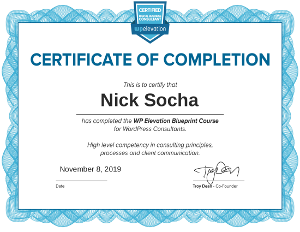

<!-- Everything to do with Nick Socha learning image. -->

<!-- Start of 2019 -->

# 2019

<!-- WP Elevation Blueprint Course -->

##  [ WP Elevation Blueprint Course](https://www.wpelevation.com/courses/)

> Nick Socha successfully completed the [WP Elevation Blueprint Course](https://www.wpelevation.com/courses/) on 11-08-2019 as taught by [Troy Dean](https://www.wpelevation.com/author/teerock/), [Simon Kelly](https://www.wpelevation.com/author/simon-kelly/), and friends. The course is a 6-week course about mastering essential business skills, practices and techniques needed to build more profitable digital businesses.

##

<!-- JavaScript: Understanding the Weird Parts -->

## [ JavaScript: Understanding the Weird Parts](https://www.udemy.com/understand-javascript/)

> Nick Socha successfully completed the course [ JavaScript: Understanding the Weird Parts](https://www.udemy.com/understand-javascript/) on 01/04/2019 as taught by [Anthony Alicea](https://www.udemy.com/user/anthonypalicea/) on [Udemy](https://www.udemy.com/). Certificate of Completion can be found [here](https://www.udemy.com/certificate/UC-VTULVINM/).

##

<!-- Modern JavaScript From The Beginning -->

## [ Modern JavaScript From The Beginning](https://www.udemy.com/modern-javascript-from-the-beginning/)

> Nick Socha successfully completed the course [ Modern JavaScript From The Beginning](https://www.udemy.com/modern-javascript-from-the-beginning/) on 01/01/2019 as taught by [Brad Traversy](https://www.udemy.com/user/brad-traversy/) on [Udemy](https://www.udemy.com/). Certificate of Completion can be found [here](https://www.udemy.com/certificate/UC-19P9RRIO/).

##

<!-- End of 2019 -->

<!-- Start of 2018 -->

# 2018

<!-- CSS Grid -->

## [ CSS Grid](https://cssgrid.io/)

> Credit and many thanks to [@wesbos](https://twitter.com/wesbos) for this awesome course.
>
> Check out all his courses at [https://wesbos.com/courses/](https://wesbos.com/courses/)
>
> CSS Grid course can be found at [CSSGrid.io](https://cssgrid.io/)
>
> Course videos are on YouTube [here](https://www.youtube.com/playlist?list=PLu8EoSxDXHP5CIFvt9-ze3IngcdAc2xKG)
>
> Starter files can be found [here](https://github.com/wesbos/css-grid)

##

<!-- JavaScript 30 -->

## [ JavaScript 30](https://javascript30.com/)

> Credit and many thanks to [@wesbos](https://twitter.com/wesbos) for this awesome course.
>
> Check out all his courses at [https://wesbos.com/courses/](https://wesbos.com/courses/)
>
> JavaScript30 course can be found at [JavaScript30.com](https://javascript30.com/)
>
> Course videos are on YouTube [here](https://www.youtube.com/playlist?list=PLu8EoSxDXHP6CGK4YVJhL_VWetA865GOH)
>
> Starter files can be found [here](https://github.com/wesbos/JavaScript30)

##

<!-- ES6 for Everyone -->

## [ ES6 for Everyone](https://es6.io/)

> Credit and many thanks to [@wesbos](https://twitter.com/wesbos) for this awesome course.
>
> Check out all his courses at [https://wesbos.com/courses/](https://wesbos.com/courses/)
>
> ES6 for Everyone course can be found at [ES6.io](https://es6.io/)

##

<!-- What The Flexbox?! -->

## [ What The Flexbox?!](http://flexbox.io/)

> Credit and many thanks to [@wesbos](https://twitter.com/wesbos) for this awesome course.
>
> Check out all his courses at [https://wesbos.com/courses/](https://wesbos.com/courses/)
>
> What The Flexbox?! course can be found at [Flexbox.io](http://flexbox.io/)
>
> Course videos are on YouTube [here](https://www.youtube.com/playlist?list=PLu8EoSxDXHP7xj_y6NIAhy0wuCd4uVdid)
>
> Starter files can be found [here](https://github.com/wesbos/What-The-Flexbox)

##

<!-- Mastering Markdown -->

## [ Mastering Markdown](http://masteringmarkdown.com/)

> Credit and many thanks to [@wesbos](https://twitter.com/wesbos) for this awesome course.
>
> Check out all his courses at [https://wesbos.com/courses/](https://wesbos.com/courses/)
>
> Mastering Markdown course can be found at [Masteringmarkdown.com](http://masteringmarkdown.com/)
>
> Course videos are on YouTube [here](https://www.youtube.com/playlist?list=PLu8EoSxDXHP7v7K5nZSMo9XWidbJ_Bns3)

<!-- End of 2018 -->
